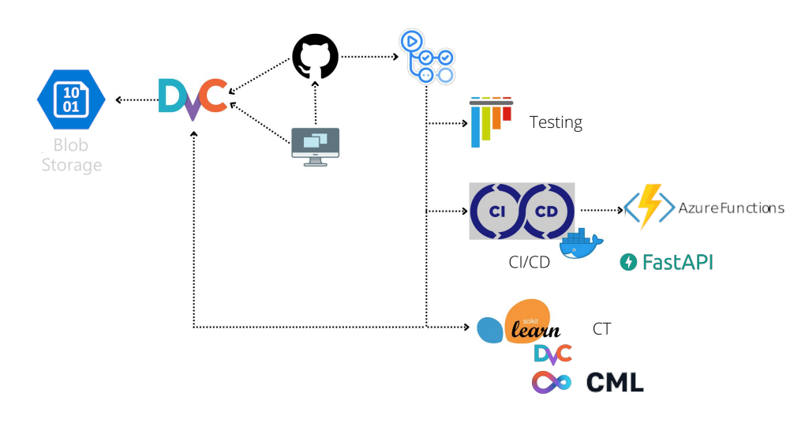

# CURSO MLops DE PLATZI

La idea es desplegar un modelo de ML con FastAPI, Docker y 3 flujos en GitHub Actions

- testing
- DVC *data version ctrl*
- CML *cointinous training*

Todo esto en la nube de Azure, utilizando los servicios *blob storage* y *functions*

El modelo es una regresion lineal que predice las ganancias de filmar una pelicula

___

## Arquitectura

